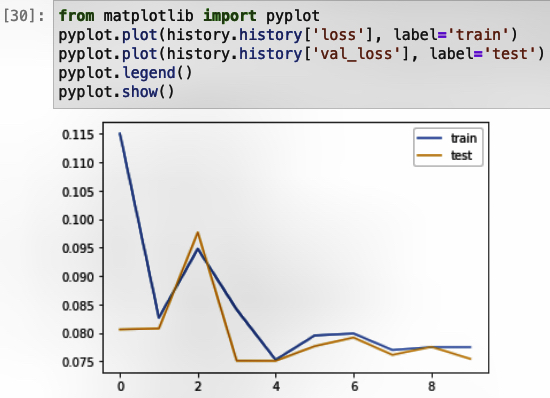
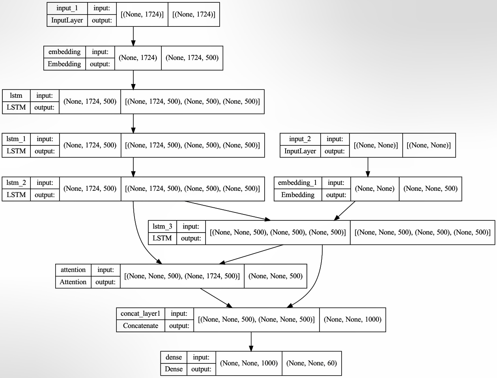
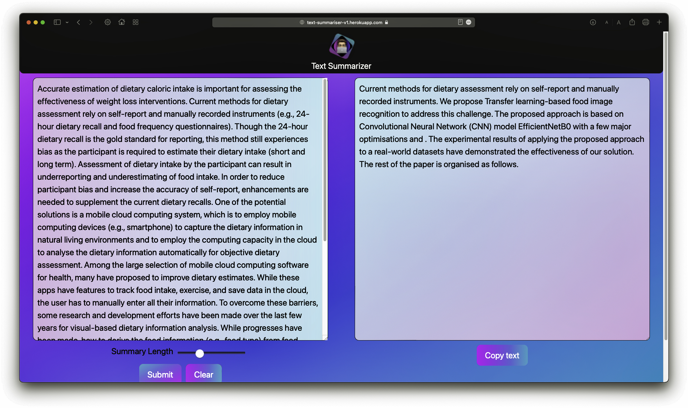

# Text-Summarizer
## About

An Abstractive text summarizer trained using lstm based sequence to sequence model with attention mechanisim. The attention model is used for generating each word of the summary conditioned on the input sentence.

- Used CNN_DailyMail dataset.
- Code + Deployment : https://www.youtube.com/watch?v=LFZBA99NOpU

### Training Model Overview

loss graph

encoder-decoder overview

## Conclusion
- 🫶  The machine learning model to convert a text document to abstract is done successfully.
- 🫶  Created a Flask app using an api call from my hugging face repository & deployed the app in heroku app.

## Deployment:

- 🫶  https://text-summariser-v1.herokuapp.com/
